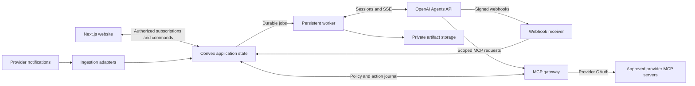

# Astra HQ web migration plan

Historical exploration dated September 11, 2026. Implementation was authorized afterward. Use [deployment](deployment.md) and [operations](operations.md) for the current application; the text below records the original investigation.

The checkout is on `main`, fast-forwarded from `3a670b6` to upstream `110d2ba`. No application code, dependencies, demo branches, or deployments were changed during this exploration. This document is the only new repository file.

Build a Next.js website backed by the new OpenAI Agents API. Route business data access and actions through approved MCP connections. Replace the desktop agent backend, preserve useful presentation components, and remove shipped demo behavior. Add a free employee marketplace with private, versioned instructions and skills managed by platform administrators.

My recommendation is Next.js, Convex for application state and subscriptions, a persistent Node worker, and an application-controlled MCP gateway. Prove the gateway, recovery, and compensation contracts with one real integration before migrating the entire UI.

The working assumptions are company workspaces with member/admin roles and centrally funded OpenAI API usage with workspace budgets. These are proposals pending product decisions. Keep the office presentation unless a separate redesign is requested. No geometry, rendering, or visual redesign is included in this plan.

## What changes in this repository

The current application is React/Vite plus Electron, with SQLite, local Codex subscription sessions, optional Responses API sessions, and extensive demo playback. Changing the API client alone will not produce the requested product.

| Area                                                                                                                 | Proposed treatment                                                                                                                                                                                                                                           |
| -------------------------------------------------------------------------------------------------------------------- | ------------------------------------------------------------------------------------------------------------------------------------------------------------------------------------------------------------------------------------------------------------ |
| `desktop/main.ts`, `desktop/preload.ts`, desktop packaging and launch scripts                                        | Replace IPC, native lifecycle, filesystem dialogs, and desktop credentials with web authentication, authorized server operations, uploads, and downloads. Remove Electron from the production build.                                                         |
| `desktop/chatgpt.ts`, `runtime/codex.ts`                                                                             | Remove local Codex processes, subscription login, local account reuse, and quota fallback behavior.                                                                                                                                                          |
| `desktop/hosted.ts`, `desktop/gateway.ts`                                                                            | Replace Responses API and existing gateway execution with the Agents API session contract. Do not preserve multiple agent execution modes.                                                                                                                   |
| `runtime/engine.ts`, `runtime/fixtures.ts`, desktop planning and dispatch                                            | Replace local orchestration and fixture workflows. Keep roadmap/review product behavior only where it maps to real persisted tasks and session events.                                                                                                       |
| Legacy `electron/` backend and `src/client.ts`                                                                       | Remove the second local execution stack. Its existing SSE preview bridge targets an older schema and is not a drop-in web backend.                                                                                                                           |
| `runtime/store.ts`, desktop workspace persistence                                                                    | Replace local application storage with workspace-scoped backend records and an append-only action history. Do not automatically import demo records.                                                                                                         |
| `shared/types.ts`, `shared/schemas.ts`, frontend store and `src/App.tsx`                                             | Replace desktop bridge and mutable workspace snapshots with web contracts, authorized queries, commands, and live subscriptions.                                                                                                                             |
| `src/components/ChatGPTProfile.tsx`, `EmployeeForm.tsx`, settings/integration views                                  | Replace account/subscription controls. Hiring selects a published employee version. Instructions and skills move to platform administration.                                                                                                                 |
| `src/components/Pages.tsx`, `HQFeatures.tsx`, `Roadmap.tsx`                                                          | Reuse appropriate presentation; replace data loading, approval, files, and task lifecycle behavior.                                                                                                                                                          |
| Office, avatar, typography, and layout assets                                                                        | Retain useful presentation. Load browser-only office rendering in a client component; provide a usable task interface if WebGL is unavailable.                                                                                                               |
| `shared/demo.ts`, `desktop/demo*.ts`, `desktop/launch*.ts`, demo UI and playback                                     | Audit imports, then remove demo execution, launch scenarios, fake results, and sample automation from main. Some launch files mix responsibilities and need inspection before deletion.                                                                      |
| `src/lib/product-launch-demo.ts`, `use-product-launch-playback.tsx`, `public/demo/`, `demo-data/`, demo scripts/docs | Preserve on the demo branch, then remove production references and sample content. Keep isolated test fixtures only where a real contract needs them.                                                                                                        |
| `studio/`                                                                                                            | Its Next/vinext/Cloudflare prototype still uses fake data and localStorage with an empty database schema. Use selected visual components as donors for a clean root Next application. Do not adopt its demo backend or assume its hosting choice is settled. |

Remove `studio/` after porting its selected components and updating their imports. The legacy removal scope also includes `electron/runtime-host.ts`, `src/shared/types.ts`, `scripts/build-electron.mjs`, and scripts that launch the old preview/auth runtime. Remove the old `window.office` bridge alongside `window.ahq`.

Fake data also appears in the default employees and sample state in `src/lib/store.ts`, its initialization in `desktop/main.ts`, roster restoration in `desktop/roster-migration.ts`, plus `studio/app/data.ts` and `studio/app/workflows.tsx`. Removal needs an import and production-bundle audit, not only deletion of files named demo. The current `DesktopAPI` has more than 50 methods and the renderer uses `window.ahq`; replace that boundary rather than emulate IPC in a browser.

Current audit records are coarse text events and whole workspace snapshots. Desktop restore explicitly leaves cloud effects unchanged. Retain useful review/versioning concepts, but the existing journal cannot establish who authorized a particular provider mutation or how to compensate it.

For Announce, propose browser MediaRecorder capture and an authenticated server transcription route, with typed announcements as the fallback. This auxiliary audio API does not execute business actions; confirm that exception to the MCP boundary before adding it. Browser permission denial must leave typed input usable. Do not leave Finder, local folder selection, or macOS settings links in web flows.

Before the first removal, preserve the exact pre-migration commit on a `demo` branch and push that branch. If that name already exists, inspect it and choose a dated branch rather than overwrite it. Record the commit in the migration notes. Keep demo maintenance off main; do not ship a demo feature flag or sample-data fallback in the website.

Existing user data needs an explicit export and import decision. Preserve the old checkout's data and original exports. A future importer must distinguish real records from fixtures and import historical activity as historical, without dispatching old jobs or claiming external actions can be undone.

## Agents API contract verified against current documentation

Use `client.beta.agents.sessions` from the official OpenAI SDK. Raw HTTP calls use `/v1/agents/sessions` and `OpenAI-Beta: agents=v1`. The application key needs `api.agents.read`, `api.agents.write`, and `api.responses.write`; the last scope authorizes inference, not a reason to retain our old Responses backend. Keep the key server-side and outside agent sandboxes. Pin the SDK version that passes the integration checks. [Quickstart](https://developers.openai.com/api/docs/guides/agents-api/quickstart)

OpenAI runs the harness, context management, and tool loop. Our backend owns authorization, task records, approvals, integration grants, budgets, and the user-facing audit. The API retains session state and currently supports US data residency only, without Zero Data Retention. Confirm those constraints fit the intended customers before production. [Overview](https://developers.openai.com/api/docs/guides/agents-api/overview)

Start one session per task/conversation and employee installation, within one workspace and authorization context. Reuse it for revisions and follow-up messages. An input message during active work steers that turn; it must not accidentally become a second independent assignment. Use `agent.session.input.message` and `agent.session.input.cancel` through session events. Serialize application commands per session. Cancellation stops future work but cannot recall an external action already dispatched. [Sessions](https://developers.openai.com/api/docs/guides/agents-api/sessions)

Compile private employee instructions into `agent.instructions`. Store immutable published employee versions ourselves. A saved OpenAI agent is optional; it is not the marketplace database. Session overrides replace supplied objects and arrays rather than deep-merge them, so always compile the complete authorized tool list. [Configuration](https://developers.openai.com/api/docs/guides/agents-api/configuration)

Use a hosted sandbox for employees with file-based skills or artifact work. Package approved skills as a skills-only plugin ZIP in `environment.plugins`; the compiler supplies MCP connections separately. Do not permit plugin archives to introduce `.mcp.json` endpoints, executables, or credentials. Create new sessions when changing the published employee version because existing sessions do not reload plugins. [Plugins](https://developers.openai.com/api/docs/guides/agents-api/tools/plugins)

For simple tool-only employees, `environment.type: "none"` avoids sandbox compute, but has no filesystem or file-based skill loading. Do not silently flatten skill behavior into a prompt and claim parity. [Architecture](https://developers.openai.com/api/docs/guides/agents-api/architecture)

Configure hosted sandbox networking explicitly. Prefer disabled outbound networking with service-origin MCP calls to our gateway. Prove this combination in the initial spike. Local file computation is allowed; external application access still goes through MCP. No provider credentials enter the sandbox. Hosted stdio MCP requires enabled networking today, so it is outside this initial design. [Hosted sandboxes](https://developers.openai.com/api/docs/guides/agents-api/environments/openai-hosted)

Keep durable outputs in application object storage, with workspace authorization and provenance. Hosted files under `/workspace/outputs` become immutable artifacts at turn completion; download required artifacts before deleting their session. A live sandbox filesystem is not our archive. [Files and artifacts](https://developers.openai.com/api/docs/guides/agents-api/environments/files)

Initially disable subagents. Later enable them only for an employee version that has passed delegation checks. Subagents inherit MCP access and share the sandbox filesystem; they are not a boundary between employees with different permissions. Separate marketplace employees use separate sessions. [Multi-agent](https://developers.openai.com/api/docs/guides/agents-api/multi-agent)

## Backend and live interface

Next.js owns routes, authenticated page composition, and the browser application. It can run as a Node service or container; choose hosting after a deployment spike. Do not couple a multi-hour agent session to the lifetime of a page request. [Next.js deployment](https://nextjs.org/docs/app/getting-started/deploying)

Convex is a good fit for office status, task lists, inboxes, approvals, and marketplace state because query subscriptions update with their underlying data. Use server-side authorization on every query and mutation, including subscriptions. Platform publishing roles are separate from customer workspace administration. [Convex realtime](https://docs.convex.dev/realtime)

The worker owns session submission, event capture, reconciliation, and external action jobs. Convex actions have bounded execution time, currently 10 minutes for Node and 30 minutes for the Convex runtime, so do not hold an entire long-running OpenAI stream inside one action. Large transcripts and media also exceed the intended shape of a single document; Convex documents have a 1 MiB limit. [Convex limits](https://docs.convex.dev/production/state/limits)

Use short transactional mutations for durable job claims, event batches, approval transitions, and read models. Jobs have leases and recoverable ownership. External execution happens outside database transactions. Store enough dispatch state to reconcile a worker crash without automatically duplicating a write.

The browser uses Convex subscriptions. The worker consumes OpenAI SSE. Ordinary authenticated commands handle chat, cancel, and approvals. Do not add a second browser WebSocket/SSE state channel just to use both technologies. Coalesce text updates into short batches while persisting action transitions immediately. Keep sequence numbers and show connection/recovery state.

A reasonable alternative is Postgres, an outbox/job worker, and SSE to browsers. It gives more direct SQL reporting and database access control, but requires implementing subscription fan-out and reconnect delivery. Choose it if those operational needs outweigh Convex's UI speed. Do not begin with both databases. My default remains Convex plus a worker, subject to the recovery and load spike.

### Event handling and recovery

Handle `agent.session.turn.output_text.delta` and `.done`, item changes, root/subagent attribution, environment failures, and terminal turn events. Text deltas can be absent. `agent.session.idle` is not success, and a completed turn may contain failed tools. A closed stream is not cancellation. [Events and items](https://developers.openai.com/api/docs/guides/agents-api/sessions/events)

OpenAI does not replay missed stream events. Reconnect by opening and buffering a stream, fetching current session state and all paginated saved items, then merging buffered updates by item identity. Completed items take precedence over stale deltas. Preserve a visible gap when intermediate progress was not captured. [Stream recovery](https://developers.openai.com/api/docs/guides/agents-api/sessions/events#how-to-recover-a-disconnected-stream)

Our event store deduplicates upstream `event_id`, retains session/turn/item identifiers, and assigns application sequence numbers. The browser reconstructs from our snapshots and stored events. Recovery must work after worker restarts and with no browser connected. Persist command intent before submission; if session creation times out without an ID, record an uncertain submission and reconcile instead of blindly creating another session. Verify provider idempotency support before relying on it.

Verify webhook signatures on the original request bytes, deduplicate deliveries, persist work before acknowledgment, and process it asynchronously. Webhooks signal session changes rather than token updates. In particular, the webhook uses `agent.session.action_required`, while the stream uses `agent.session.requires_action`; fetch `required_actions` for details. [Session webhooks](https://developers.openai.com/api/docs/guides/agents-api/sessions/webhooks)

Show public progress messages, tool summaries, decisions, sources, artifacts, errors, and outcome evidence. Do not invent hidden reasoning or expose private prompts through raw session/debug endpoints. OpenAI dashboard traces are useful for operators, but public trace retrieval and external exporters are not available in this beta. Our audit cannot depend on them. [Tracing](https://developers.openai.com/api/docs/guides/agents-api/tracing)

## MCP registry, authorization, and integrations

An integration is a configured connection to an approved server, with an authenticated provider identity and verified capabilities. The initial families are Linear, Slack, Google Workspace, GitHub, and Canva. Google Workspace appeared twice in the request; this plan treats it as one family with multiple product connections.

The integrations page shows provider/account identity, requested capabilities, resource scope, connection health, inbox support, approval policy, and correction support. States include disconnected, awaiting consent, connected, degraded, revoked, and unavailable. Empty states contain no sample messages or fabricated successful connections.

Store registry entries for server identity, approved URL, transport, OAuth configuration, supported tool schema versions, resource filters, and operation policy. Provider names and setup metadata are legitimate configuration. Provider execution must not be embedded in UI switches or employee prompt text. A provider-specific adapter is still needed when pagination, permissions, event ingestion, or correction semantics differ.

The Agents API supports remote HTTP MCP, `allowed_tools`, required initialization, and service-origin connections. It calls the MCP server directly. The current create-session reference does not document a Responses-style `require_approval` field. Do not transplant the old approval protocol. [MCP guide](https://developers.openai.com/api/docs/guides/agents-api/tools/mcp), [create-session reference](https://developers.openai.com/api/reference/resources/beta/subresources/agents/subresources/sessions/methods/create)

Point the agent only at our MCP gateway, which checks policy and writes the action journal before forwarding to approved provider MCP servers. Supply an explicit tool allowlist. The gateway independently enforces the same permissions on every call, including after revocation; model instructions and tool discovery are not sufficient enforcement.

Effective access is the intersection of the published employee requirements, workspace policy, hiring user's current provider grant, selected resources, and task-specific restrictions. Resolve it when hiring, before starting a session, and before executing each call. Missing required access blocks the relevant task. Missing optional access disables that capability and explains the consequence.

Use a short-lived, run-scoped gateway credential bound to server-side identity records. Do not trust a tenant ID or employee ID supplied in model arguments. Keep provider OAuth grants in a secret store controlled by the gateway. Handle consent, PKCE where supported, refresh, revocation, and provider-specific client registration. OpenAI vaults are an option for gateway credentials; deleting a vault does not revoke provider tokens or stop sessions. [Vaults](https://developers.openai.com/api/docs/guides/agents-api/tools/vaults)

The gateway terminates its own authenticated MCP connection and separately authenticates to the provider. It must not forward the caller's bearer token as a provider token. Validate approved destinations, redirect targets, and resolved network addresses to prevent SSRF. Resource bodies, tool descriptions, email text, and retrieved documents are untrusted input. [MCP security guidance](https://modelcontextprotocol.io/docs/2025-11-25/tutorials/security/security_best_practices)

### Initial provider coverage and limits

The entries below establish candidates, not completed integrations. Each needs a real account capability test and an ingestion/correction assessment before the UI advertises support.

| Provider         | Verified starting point                                                                                                                                                                                                     | Initial product scope and gate                                                                                                                                                                         |
| ---------------- | --------------------------------------------------------------------------------------------------------------------------------------------------------------------------------------------------------------------------- | ------------------------------------------------------------------------------------------------------------------------------------------------------------------------------------------------------ |
| Linear           | Official hosted MCP at `https://mcp.linear.app/mcp`. [Docs](https://linear.app/docs/mcp)                                                                                                                                    | First integration candidate: issue lookup and a reviewed issue update. Verify OAuth, resource filters, pagination, webhook ingestion, and update compensation.                                         |
| Slack            | Official Streamable HTTP MCP at `https://mcp.slack.com/mcp`; registered app required. Internal or marketplace-published apps are allowed; unlisted apps are prohibited. [Docs](https://docs.slack.dev/ai/slack-mcp-server/) | Read permitted channels/threads and propose messages. Public SaaS distribution needs an eligible Slack app. A read/search tool does not establish event subscription support.                          |
| GitHub           | Official remote MCP server documentation. [Remote server](https://github.com/github/github-mcp-server/blob/main/docs/remote-server.md)                                                                                      | Issues and pull request review context first. Verify the token type supported by our deployment and repository restrictions. Do not assume an arbitrary GitHub App token works with every server mode. |
| Google Workspace | Official product-specific remote MCP servers in developer preview. [Setup](https://developers.google.com/workspace/guides/configure-mcp-servers)                                                                            | Start with Gmail, Drive/Docs, and Calendar read access. Add Sheets/Slides for employees that need them. Gate access on preview eligibility and actual tool discovery.                                  |
| Canva, optional  | Official Canva MCP documentation and tool catalog. [Overview](https://www.canva.dev/docs/mcp/), [tools](https://www.canva.dev/docs/mcp/tools/)                                                                              | Enable only for an employee whose task needs design creation and whose customer has compatible access. Verify available tools and plan limits first.                                                   |

Salesforce and ServiceNow were dropped on September 11, 2026 because both require per-customer instance and OAuth client setup.

If an official MCP cannot meet a required capability, mark it unsupported until we approve an operated MCP adapter. The application still calls that adapter through MCP. Do not quietly fall back to direct provider writes or install arbitrary marketplace MCP servers.

### Inbox ingestion is a separate contract

MCP tool access does not promise a push feed. Define an ingestion capability for each connection: event source, subscriptions, renewal, stable IDs, cursor/backfill, deletion signals, authorization, rate limits, and deduplication.

Prefer provider notifications delivered to an operated adapter. It verifies the event, retrieves authorized content through MCP where supported, and normalizes an inbox item with source link, provider object/version, time, permissions, and processing status. Do not expose private messages to every member merely because the workspace has a connection. Recheck visibility when serving cached data and remove access after revocation.

Gmail push, for example, uses Cloud Pub/Sub and expiring watches; a notification identifies mailbox history to retrieve rather than containing the complete email. Some notifications may be delayed or lost. A live UI does not remove the need for backend recovery and subscription renewal. [Gmail push](https://developers.google.com/workspace/gmail/api/guides/push)

Decision needed before implementation: does "strictly MCP" allow provider event/OAuth APIs inside the integration service? I recommend yes, while all agent business reads and writes remain MCP-only. If it means no provider API use anywhere, use MCP servers that implement ingestion themselves or label those inboxes on-demand. Do not promise all six continuous streams until their notification contracts are proven. Any periodic backend reconciliation must be bounded and explicit; browser polling is unnecessary.

## Google Workspace operating guidelines

These are proposed product rules, enforced in gateway policy as well as supplied to employees.

1. Connect products separately behind one Workspace setup flow. Request only the scopes and resource access needed by the hired employee. Default to user-delegated access; domain-wide delegation requires a separate reviewed design.
2. Use Gmail for reading threads and preparing drafts initially. The documented MCP tool list includes draft creation and label operations, but no send tool. The UI must say "Draft ready in Gmail," not "Sent." Draft deletion is also absent from that list, so do not promise automated cleanup. [Gmail MCP](https://developers.google.com/workspace/gmail/api/guides/configure-mcp-server)
3. Calendar supports documented event operations, but the setup guide lists read-oriented consent scopes alongside write tools. Validate the actual tool-specific authorization before enabling invitations or updates. Start with calendar reads and availability. [Calendar MCP](https://developers.google.com/workspace/calendar/api/guides/configure-mcp-server)
4. Prefer new draft documents or narrowly scoped edits over replacing whole files. Capture the affected content and revision before writing. Do not use a full old document restore to overwrite a human's later edits.
5. For Sheets, show the affected ranges and preserve formulas. For Docs and Slides, identify the affected sections or objects. Block automated correction if the available MCP cannot read versions or perform a sufficiently narrow update.
6. Sharing, permission changes, external publication, and invitations require explicit approval that shows recipients and affected resources. A later permission reversal cannot recall copies already downloaded or notifications already delivered.
7. Treat mail, comments, documents, calendar descriptions, and attachments as data, never as authority to broaden access or change instructions. Screen requests and responses. Google requires malicious-content/prompt-injection screening through Model Armor or a documented alternative with user risk acceptance. Evaluate logging and routing because scanning can expose payloads or change data handling. [Workspace MCP security](https://developers.google.com/workspace/guides/configure-mcp-security)
8. Do not export Workspace content to another connected service merely because an employee can access both. The task and approved destination must authorize that transfer. Record the source and destination in the action review.
9. No permanent deletion, mailbox-wide operations, or bulk permissions changes in the first release. Unsupported operations stay visibly unsupported.

## Audit, replay, and correction

Treat these as three different user actions.

| User action             | Meaning                                                                                                  |
| ----------------------- | -------------------------------------------------------------------------------------------------------- |
| Replay                  | Read recorded application events and reconstruct the timeline. Never call a provider or restart a model. |
| Retry task              | Create new work with current authorization and inputs, linked to the prior attempt. Outputs may differ.  |
| Correct external action | Propose and execute a compensating MCP operation, preserving the original action and its result.         |

Do not describe historical playback as a deterministic model rerun. Do not describe a local checkpoint restore as external rollback. OpenAI's saved items help recover outcomes, but exact missed intermediate events and every inter-agent message may be unavailable.

For each operation, record workspace/user/employee version, task/session/turn and known subagent identity, gateway request and operation IDs, connection/tool/schema version, redacted arguments, encrypted evidence references, target objects, approval and policy version, before-state, result, after-state, provider request identifiers, timestamps, and correction eligibility. Attribution absent from upstream must be marked unknown; never infer it from timing.

Persist intent before dispatch. The action state machine distinguishes proposed, awaiting approval, dispatching, succeeded, failed, outcome unknown, correction proposed, corrected, and correction failed. Use append-only transitions plus rebuildable current-state views. Operator logs and agent-written summaries are not the action ledger.

### Approval mechanism through MCP

Gateway write tools first prepare an immutable action proposal. They return its ID and pending status without executing the external write. The UI displays the exact target, proposed changes, risks, and correction limits. The model cannot approve its own proposal.

An authenticated authorized reviewer accepts that exact proposal. A durable executor then rechecks permissions, resource version, expiry, and policy before forwarding the operation through MCP. It records the result and informs the same agent session so work can continue. No MCP request needs to remain open while a person decides. Prevent automatic dependent writes until prerequisites are confirmed.

Bind approval to normalized arguments and the before-state/version. A changed target, newly added recipient, permission expansion, or stale before-state requires a new proposal. Repeated approval clicks and worker retries must not repeat the external operation. Use provider idempotency where available and a durable operation ID; a gateway database lock alone does not guarantee exactly-once effects across a network.

On a timeout after dispatch, record "Outcome unknown" and reconcile using provider evidence. Never retry a non-idempotent send/create blindly. Stop new dispatch when a task is cancelled; reconcile operations already in flight.

### Correction policy

| Action                                  | Proposed correction                                                                         | Limit to show before execution                                                      |
| --------------------------------------- | ------------------------------------------------------------------------------------------- | ----------------------------------------------------------------------------------- |
| Linear or GitHub status or field change | Apply a conditional compensating update and link the original action.                       | Later human changes, workflow rules, and missing update tools can block correction. |
| Comment or Slack message                | Post a correction, or edit only when policy and tools permit.                               | Recipients may already have read it; notifications remain.                          |
| Gmail draft                             | Let the user review/edit it in Gmail; automate cleanup only if a verified tool supports it. | Creating a draft does not establish MCP deletion or send support.                   |
| Calendar invitation                     | Update or cancel through supported tools after review.                                      | Notifications and attendee reactions cannot be recalled.                            |
| Shared document edit                    | Restore the affected content using version checks, or prepare a reviewed manual correction. | A whole-document restore can destroy unrelated later edits.                         |
| Generated artifact                      | Publish a new version and mark the old one superseded.                                      | Copies downloaded or published elsewhere cannot be recalled.                        |

These are policy patterns, not claims that every listed server exposes the necessary operation. Each enabled write tool needs a tested correction descriptor: supported, partially compensatable, manual only, irreversible, or unknown. Unknown operations cannot be advertised as reversible.

Pre-read then write is not atomic when the provider MCP lacks conditional updates. In that case disclose the race, use a safer draft/manual workflow, or disable autonomous correction. Never claim application locks prevent external users from editing records.

A multi-service task is not one transaction. Correct completed steps in dependency-aware order, stop on conflicts, and show partial recovery. Store the original history permanently within the chosen retention policy; correction appends evidence rather than deleting it.

Separate sensitive evidence from the append-only metadata journal. Define retention, export access, redaction, and deletion handling before launch. If tamper-resistant retention is required, export signed/checksummed journal batches to independently controlled immutable storage; an application convention alone is not tamper-proof.

## Employee marketplace and administration

The marketplace is a separate tab with search, categories, thumbnails, image/video galleries, task examples, strengths, limitations, required and optional integrations, and a free Hire action. List only real published employees. Free means no marketplace purchase charge; model, sandbox, and connected service usage still incur costs.

Separate a public listing from a private executable definition. A published version contains immutable instruction text, skill versions and hashes, required/optional capability IDs, allowed tool operations, environment settings, and policy/evaluation version. Public descriptions explain behavior without returning the private bundle.

Hiring creates a workspace installation pinned to a published version. Show a readiness checklist for required connections, consent, selected resources, and optional capabilities. Allow a pending installation, but do not run blocked tasks. Customer users can provide tasks and permitted configuration; they cannot edit or download employee instructions or skills.

Platform administrators can create drafts, edit the instruction document and skill associations, select approved capabilities, manage listing media, validate, publish, unpublish, and retire versions. A published version is immutable; edits create a new version with a diff and evaluation record. Existing sessions remain pinned. Users explicitly accept capability-expanding upgrades and grant new access before activation.

The two-way dependency check works at publication and runtime. An employee cannot publish with unknown capabilities. Retiring a registry capability identifies affected employees/installations and blocks affected new work. Revocation also stops existing gateway access immediately, even if an OpenAI session still lists the tool.

The compiler rejects unknown MCP IDs, arbitrary endpoints, unsafe archive paths, unexpected scripts, secrets, and plugin-supplied MCP definitions. The runtime uses only registry-resolved endpoints and authorized connections. A sentence in an instruction file cannot grant a capability.

Private instructions stay out of browser bundles, customer APIs, ordinary exports, and downloadable artifacts. However, an agent that reads instructions can leak portions in generated text. Hiding files from the UI is not a guarantee of prompt secrecy. Keep credentials out of instructions, isolate admin APIs, filter exposed event fields, and test extraction attempts before publishing. Do not promise mathematical secrecy for content supplied to the model.

An image-generation employee can require an approved image-generation MCP or Canva capability. Add that integration only when a published employee needs it. If no suitable server exists, plan a narrow operated MCP wrapper as a separate integration, with quota and artifact provenance controls.

## Proposed data boundaries

Use workspace IDs on all customer records and enforce membership plus provider visibility in server functions. Keep platform authoring records in an admin-only boundary.

| Records                                                    | Purpose                                                                           |
| ---------------------------------------------------------- | --------------------------------------------------------------------------------- |
| Workspaces, memberships                                    | Tenant identity and roles.                                                        |
| Capability registry, connections, grants                   | Approved tools, provider identity, resource scope, secret references, and health. |
| Listings, employee versions, skill versions, installations | Public discovery and private versioned behavior.                                  |
| Inbox sources/items/cursors                                | Authorized incoming work and deduplicated ingestion state.                        |
| Tasks, sessions, turns, commands/jobs                      | Application lifecycle and durable provider mappings.                              |
| Events, action proposals, approvals, action transitions    | Playback, authorization evidence, and external-effect history.                    |
| Artifacts and evidence references                          | Authorized file access, versions, hashes, and provenance.                         |

Never treat browser-supplied workspace/session IDs as authority. Do not persist tokens inside historical workspace snapshots. Separate platform admin access, workspace admin access, and source-data access.

## Implementation order and completion gates

1. Confirm the product decisions below and preserve the demo branch before removal. Export any real desktop data. Inventory the final demo/runtime dependency graph.
2. In an isolated spike, use the actual Agents API with one real Linear test workspace. Prove private skill loading, gateway-only tool access, one reviewed update, correction, cancellation, stream recovery, and grant revocation. Record SDK versions and observed contracts. No fabricated production data or fake successful results.
3. Build the Next.js authenticated shell, workspace roles, Convex schema, worker deployment, secret handling, and event journal. A task must continue while all browsers are closed and recover after a worker restart.
4. Implement registry and integrations onboarding, first inbox adapter, and operation proposals. Test cross-workspace denial and provider resource visibility before enabling writes.
5. Move task/chat/review/files/roadmap views to live web contracts. Keep intermediate updates and connection state visible. Remove desktop bridges, local subscription controls, Responses execution, production fixtures, and demo imports once replacement flows work.
6. Add admin publication and the free marketplace. Test private bundle access denial, version pinning, missing requirements, capability retirement, and reconsent on upgrades.
7. Add the remaining provider families using the same admission checklist. Ship only verified capabilities. Resolve Slack distribution and Google preview access before calling those connections production-ready.
8. Verify browser behavior, worker restart recovery, webhook duplication, unknown write outcomes, expired approvals, concurrent human edits, and correction failures. Run targeted contract tests during each step, then broader build/integration checks for the final cross-cutting migration.
9. Deploy the website, worker, gateway, backend functions, callbacks, and scheduled ingestion maintenance in the documented order. Verify real sessions and notifications in production, monitor failures, and preserve the last working release. A rollback must stop dispatch and reconcile in-flight external actions; restoring a deployment never undoes those actions.

Specific acceptance criteria include no production demo payloads or seeded employees, no `window.ahq`/Electron bridge requirement, no local Codex or ChatGPT subscription dependency, no direct agent provider API credentials, no unauthorized MCP discovery/calls, no browser polling loop for live state, and no replay-triggered external effects.

## Decisions before implementation

- Company workspaces versus a single-user product. Proposed default: workspaces with member/admin roles and provider visibility preserved per user.
- Central API billing versus customer API keys. Proposed default: central billing with workspace budgets and usage visibility. Missing usage must remain unknown, not zero; upstream usage is best-effort and not a final bill. [Observability](https://developers.openai.com/api/docs/guides/agents-api/observability)
- The MCP boundary for ingestion and OAuth. Proposed default: provider event/setup APIs inside operated adapters, all agent business operations through MCP.
- Whether voice Announce remains in the first web release. Proposed default: preserve it through browser capture and server transcription, subject to the auxiliary API boundary above.
- Convex plus worker versus Postgres plus worker. Proposed default: Convex, validated with an event-volume and recovery spike.
- Launch access to Slack and the Google preview, plus whether any real desktop data needs import.
- Initial operation approval scope and retention. Proposed default: reads within an approved task, explicit review of external writes, no permanent deletion. Set concrete retention periods before storing customer evidence.

This exploration read the Agents API overview, quickstart, architecture, configuration, sessions, events, session management, webhooks, hosted/self-hosted environments, security, lifecycle, files, MCP, plugins, vaults, functions, multi-agent, observability, tracing, and the create-session reference. It did not execute paid API calls or authenticate to customer MCP servers. Documentation confirms the design inputs; the spike must establish account access and end-to-end behavior before implementation is called production-ready.
